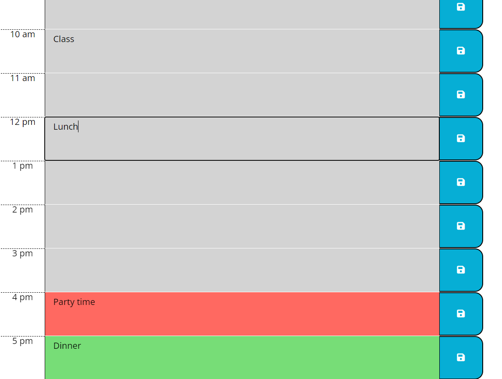

# Creating a Day Planner Using Third Party APIs

## Description
Have you ever wanted to keep track of your appointments and scheduled events and duties throughout the day? Now you can, right from your browser. A standard 8-hour work day plus lunch is broken up into individual slots by the hour. Each hour has a corresponding text area for you to input your to-do's for that time slot; you can save these events using the save button at the end of each row so that you'll never lose your notes, even when you restart the page! As the day goes on, the day planner will tell you which events/hours have passed, which that have yet to come, and which hour you're currently in. Grey means the hour has passed, green means a future hour, and red indicates when you are at the current time. 

The body of this application is all dynamically created through Javascript with the exception of most of the header text. In order for the scheduler to work, each row has its particular text area with its own data attribute linked with the corresponding hour. When the save button for that row is clicked, it is able to save any inputted text from the textarea within the same div to local storage. When the page is restarted, that key is retrieved out and put back into the same place using the same identifers. 

Moment.js, a third party API, was used for the time-related functions needed within the planner; for example, the current day at the top of the page is queried through a Moment.js function, and the exact current hour of the day referenced throughout the script functions when comparing hours utilized Moment. JQuery was a once popular external Javascript library with its own tweaks to syntax and functionality that was used as an extension to vanilla Javascript to build the script. These external resources are linked in the HTML alongside the standard JS page. These were the greatest challenges for this project - to shift from the normal Javascript that you learn first to the style of jQuery takes some getting used to. Moment.js also has many of its own functions and idiosyncrasies for its syntax that needed to be learned and properly utilized for this application to work. 

Though there is a CSS page provided, external CSS resources were also used. Bootstrap is a popular third party CSS library that makes it easier for developers to style their pages without manually creating all the styles themselves. In this they are used to make sure the rows and their elements neatly aligned across the page and take up an appropriate amount of space. Font Awesome is a library of icons - the save button icon used in the scheduler is sourced from them. Finally, the fonts used on the page are found through Google Fonts, which provides many other styles of fonts that a developer's device might not have innately. 

### Technologies 
- HTML (template provided)
- CSS (template provided)
- JavaScript
- jQuery
- Moment.js 
- Bootstrap
- Font Awesome
- Google Fonts

### Final Page Image

### Github Link
[Deployed application through Github](https://reversedentistry.github.io/Work-Day-Scheduler-with-Third-Party-API/)